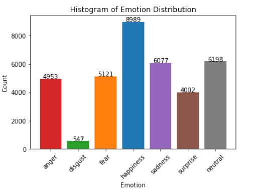

### Theoretical background

Facial expressions play a crucial role in human interaction, serving as a primary means of
conveying emotions across cultures. These emotions enable individuals to express themselves
and comprehend the emotional states of others. Facial Expression Recognition (FER) involves
detecting and interpreting a person’s emotional state based on their facial expressions. Deep
learning-based systems are widely being adopted and explored for developing automatic FER
systems that directly classify human emotion from face images.

### Dataset
The FER2013 - is a Kaggle dataset that designed for research in facial emotion recognition and comprises
grayscale images of facial expressions. It contains a total of 35,887 images, each with dimensions
of 48x48x1 pixels (grayscale). The dataset is annotated with one of seven emotional categories: anger,
disgust, fear, happiness, sadness, surprise, and neutral. The images were collected from multiple
sources and subsequently labeled manually by human annotators.

The distribution of images
across different emotions is visually depicted in picture below.

### Project
1. This research project developed a deep learning-based system for recognizing seven basic emotions: anger, disgust, happiness,
sadness, and surprise from human face images. Two convolution neural networks (CNNs) (*shallowcnn.jpynb*), Shallow CNN and Deep CNN (*deepcnn.jpynb*), are developed and compared, along with exploring the effects of data augmentation and hyperparameter tuning.
Additionally, the transfer learning approach using the MobileNet architecture is examined (*mobilenet.jpynb*).
2. Furthermore, the project also evaluates the feasibility of this system in real-time settings (*real_time_fer*).The Haar Cascade Frontal Face detection system was used to detect and extract face images from each live video frame, and the Deep CNN network classified these images into emotions. The detected face region was marked with a blue detection window, and the
corresponding emotion category was displayed. The Deep CNN network successfully detected
all seven emotions in the live video.

