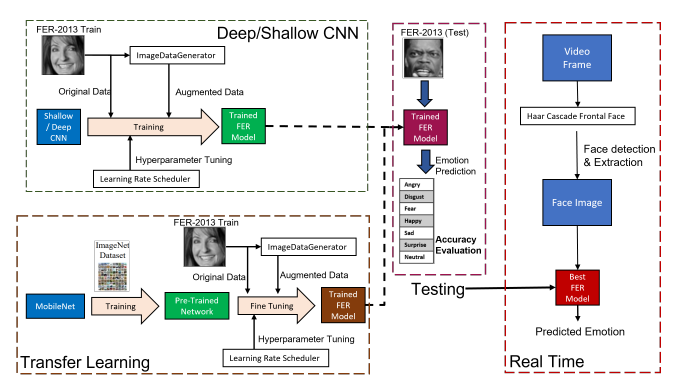
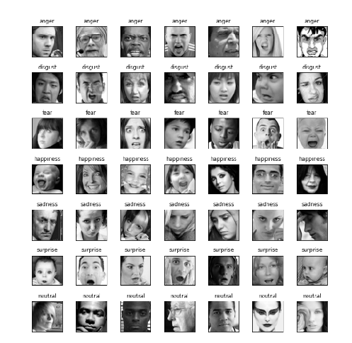
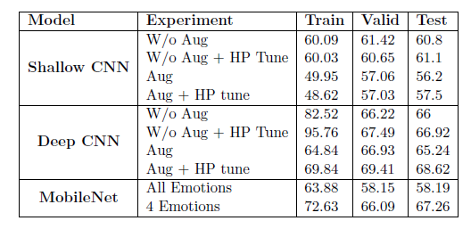
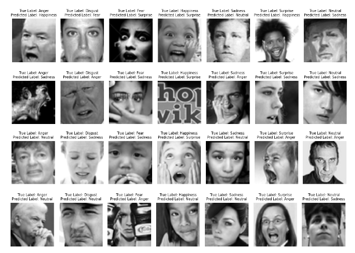
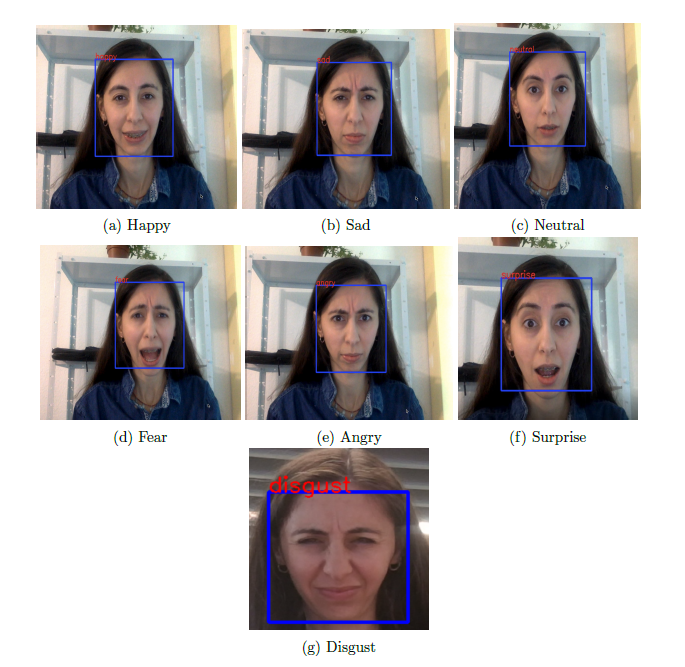

## FER - Facial Emotion Recognition
### Theoretical background

Facial expressions play a crucial role in human interaction, serving as a primary means of
conveying emotions across cultures. These emotions enable individuals to express themselves
and comprehend the emotional states of others. Facial Expression Recognition (FER) involves
detecting and interpreting a person’s emotional state based on their facial expressions. Deep
learning-based systems are widely being adopted and explored for developing automatic FER
systems that directly classify human emotion from face images.

### Project Implementation
#### Overview

1. This research project employs deep learning to recognize seven fundamental emotions from facial images: anger, disgust, happiness, sadness, and surprise. We've developed and compared two convolutional neural networks (CNNs): Shallow CNN (*shallowcnn.jpynb*) and Deep CNN (*deepcnn.jpynb*). The study also delves into the impact of data augmentation, hyperparameter tuning, and the transfer learning approach via the MobileNet architecture (mobilenet.jpynb).
2. Furthermore, the project also evaluates the feasibility of this system in real-time settings (*real_time_fer*). The Haar Cascade Frontal Face detection system was used to detect and extract face images from each live video frame, and the Deep CNN (best-performing model) network classified these images into emotions. The detected face region was marked with a blue detection window, and the corresponding emotion category was displayed. The Deep CNN network successfully detected all seven emotions in the live video.

### Dataset
The FER2013 - is a Kaggle dataset designed for facial emotion recognition research and comprises grayscale facial expression images. It contains 35,887 images, each with 48x48x1 pixels (grayscale) dimensions. The dataset is annotated with one of seven emotional categories: anger,
disgust, fear, happiness, sadness, surprise, and neutral. The images were collected from multiple
sources and subsequently labeled manually by human annotators.

The distribution of images
across different emotions is visually depicted in the picture below:

### Results
#### Selection of best model

*Note: Please take a look at the notebooks for the model performance graphs and confusion matrixes.*

The performance of various models is analyzed based on their training, validation,
and test accuracy. We aim to select the best model that could be used in a Real-Time FER
system. Experiments were conducted on the FER-2013 dataset with 7 emotions
using Shallow CNN, Deep CNN, and MobileNet. These experiments were carried out with and
without data augmentation and hyperparameter tuning. Additionally, I employed transfer
learning using MobileNet and conducted two experiments - one with all emotions and another
with only the top four emotions (emotions with the higher number of samples). The table below
summarizes the results of all these experiments. It shows the training, valid, and test accuracy
of all the experiments.

It can be seen that the training and validation accuracy in each experiment are close to each
other except in Deep CNN without augmentation case. This shows that all the models learn
well during training and perform equally on the unseen validation set. However, in the case of
Deep CNN without augmentation, the high training accuracy of 82.52% without hyperparameter
tuning and 95.76% with hyperparameter tuning, as compared to validation accuracy, suggests
that the model overfits the training data. The lower training accuracy, 49.95%, and 48.62% for
experiments on Shallow CNN with augmented data indicate that the model cannot learn
effectively.
The highest test accuracy achieved by the Shallow CNN models is 61.1%, obtained without
augmentation case. However, this accuracy is relatively low compared to the other models 
experimented with augmentation. On the contrary, in the Deep CNN case, the highest test accuracy found is
68.62%, which is the best among all the experiments conducted. This best accuracy is achieved
by training Deep CNN with augmented data and learning rate tuning. Also, the less difference
between train and validation accuracy, only 0.43%, shows that the model is generalized well
to the dataset. In transfer learning experiments with Mobilenet, the test accuracy reaches
only 58.19%, which is lower than Deep CNN but comparable with Shallow CNN. In testing
MobileNet with the four emotions dataset, the test accuracy is relatively high, i.e., 67.36%. But
this model is unsuitable for Real-Time since we aim to detect all the emotions.
In conclusion, the Deep CNN trained with augmented data and hyperparameter tuning is the best-
performing model with 68.62% among all other models. Thus, this model is further used and deployed
in the Real-Time FER system.

#### Misclassified images across emotions:

Figure shows the misclassified samples from each emotion category. It can be seen that
one of the images within the dataset does not contain any identifiable face. This observation
indicates the presence of irrelevant or mislabeled images, which can hinder the model’s overall
performance. Additionally, some images exhibit variations in contrast, introducing difficulties
for the model in accurately capturing and interpreting facial expressions. Furthermore, a hand partially covers the face in several images 
while expressing emotions. These specific images challenge the model and often result in misclassifications.
Moreover, the similarity between facial expressions belonging to different emotion categories becomes apparent when examining
misclassified samples. For instance, samples where Disgust is mistakenly classified as Anger or
Sadness, or when Surprise is misclassified as Sadness or Anger, highlights the inherent difficulty
distinguishing between certain emotions based solely on facial emotions.

#### Real-time FER
The best-performing model - deepcnn is deployed for real-time facial emotion recognition. 

